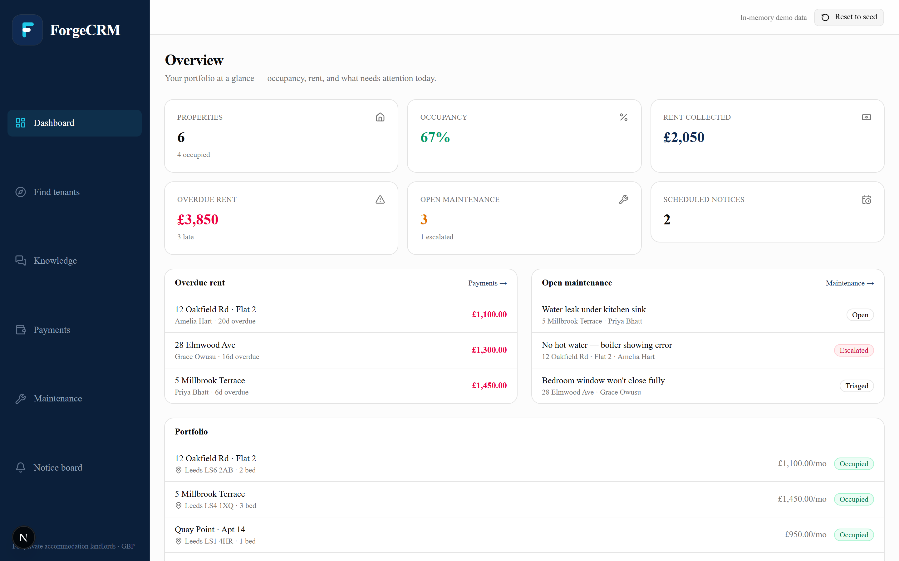
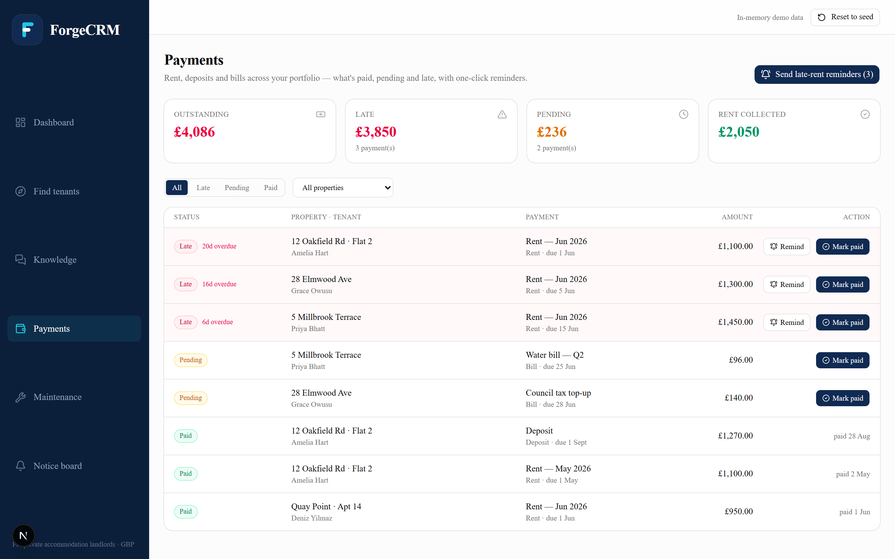
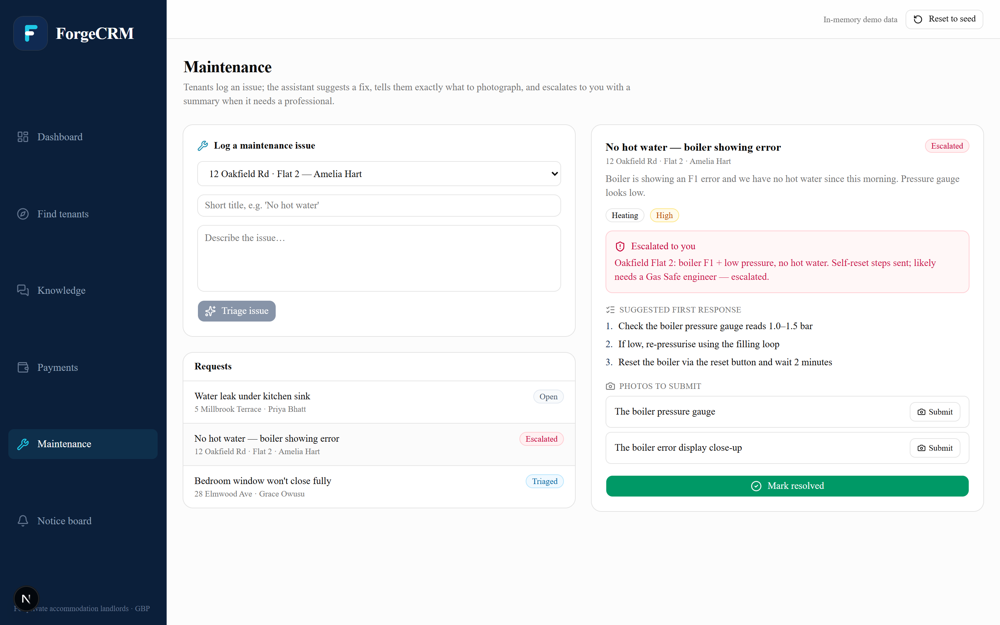
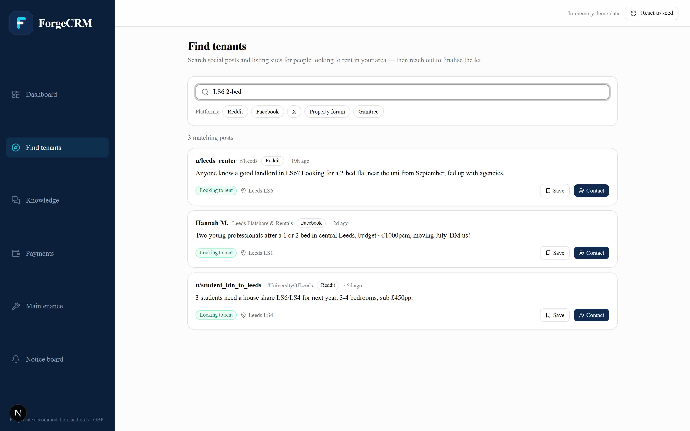
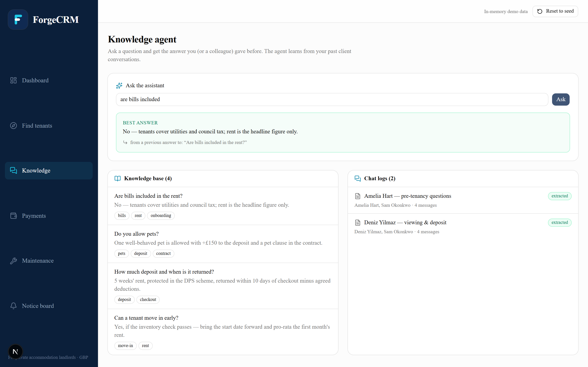

# ForgeCRM

**An AI-native CRM for private accommodation landlords.**

Built for the individual landlord (the 94% of the rental market who own 1–4 properties and can't
offload the work to an agency). ForgeCRM covers the whole journey — **find tenants, win them, and
manage the tenancy** — with AI doing the tedious parts and a deterministic core keeping the money
honest.

> **▶ Live demo:** _add your Vercel URL here after deploying_ — see [`../DEPLOY.md`](../DEPLOY.md).

## What it does (the five jobs)

| Module | Stage | What it does |
|---|---|---|
| **Find tenants** (`/discover`) | Attraction | Aggregates social/listing posts; search by terms + platform to find people looking to rent, then reach out to finalise the let. |
| **Knowledge agent** (`/qa`) | Conversion | Learns from your past client chats — ask a question, get the answer you (or a colleague) already gave, traced to its source. |
| **Payments** (`/payments`) | Management | Tracks rent, deposits and bills (pending / late / paid) and **auto-reminds tenants** when rent is overdue. |
| **Maintenance** (`/maintenance`) | Management | AI triages a tenant's issue into an ideal fix, a **guided "photograph X" checklist**, and **escalates to you with a summary** when it needs a pro. |
| **Notice board** (`/notices`) | Management | Compose and **schedule** SMS/email notices to your whole portfolio, one property, or a single tenant. |

## Screenshots

**Dashboard** — occupancy, rent, overdue, and open maintenance at a glance:



| Payments — rent & bill tracker | Maintenance — triage + guided photos |
|---|---|
|  |  |

| Find tenants — social aggregator | Knowledge — Q&A from past chats |
|---|---|
|  |  |

## Run it

```bash
npm install
npm run dev          # http://localhost:3000
npm run build        # production build
npm run rent         # quick check of the rent-ledger logic against seed data
```

**AI is optional for the demo.** Two routes use real Claude (maintenance triage, Q&A extraction)
via **tool-use with a Zod-derived schema**; both re-validate the output and fall back to a
deterministic result, so the whole app works fully offline. Set a key to use real Claude:

```bash
cp .env.local.example .env.local   # then put your key in ANTHROPIC_API_KEY
```

## Deploy (Vercel)

```bash
npx vercel          # first run links the project & ships a preview URL
npx vercel --prod   # production
```

Set **Root Directory = `forgecrm`** (the app is in a subfolder) and add `ANTHROPIC_API_KEY` in the
project's environment variables. Full runbook in [`../DEPLOY.md`](../DEPLOY.md).

## Architecture

- **Client SPA + two server routes.** Every page is `"use client"`; a Zustand store
  (`lib/property-store.ts`, persisted to localStorage) is the single source of truth. The only
  server code is `app/api/maintenance` and `app/api/qa`, which hold `ANTHROPIC_API_KEY`.
- **Deterministic core, AI at the edges.** Rent/late logic (`lib/payments.ts`), maintenance triage
  (`lib/maintenance.ts`), Q&A search (`lib/qa.ts`) and the aggregator (`lib/aggregator.ts`) are pure
  and testable; AI only turns free text into structured objects, always with a fallback.
- **One domain model** in `types/property.ts`; demo data in `data/property-seed.ts`.

Single currency GBP. A visible **Reset to seed** restores the demo state.
