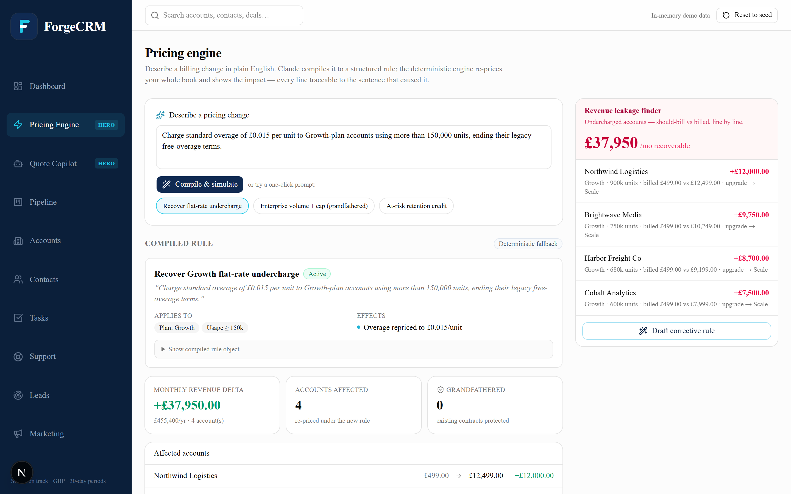
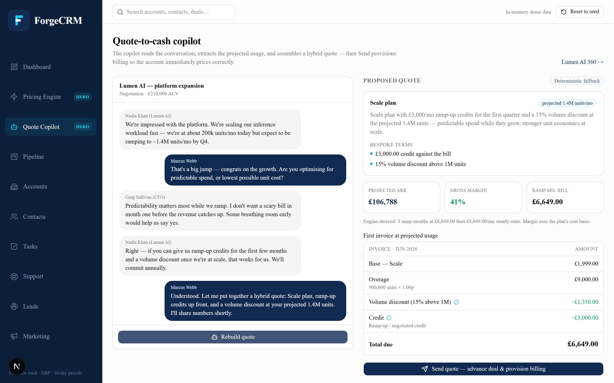
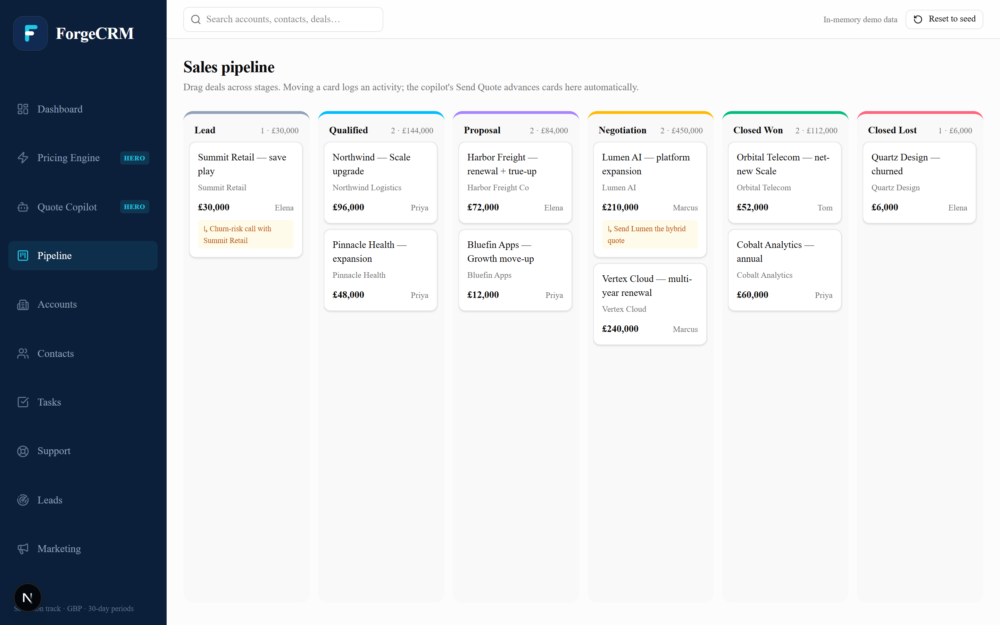
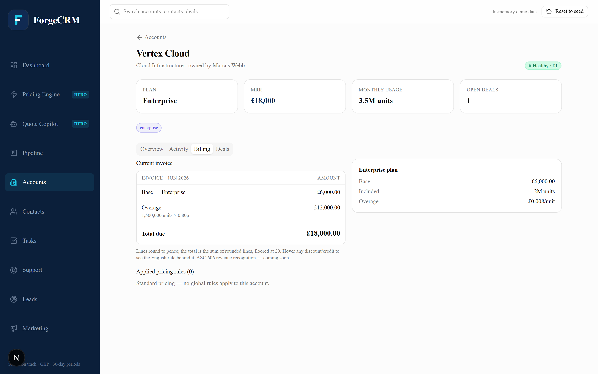

# ForgeCRM

**The CRM where pricing logic is authored in plain English, and every sales action is a billing action.**

Hackathon build (Solvimon track). The hero is a natural-language pricing engine: you type a sentence,
Claude compiles it to a structured ruleset, and a **deterministic, auditable billing engine** shows the
revenue impact across your whole customer book — every invoice line traceable to the sentence that caused it.

> **▶ Live demo:** _add your Vercel URL here after deploying_ — step-by-step in [`../DEPLOY.md`](../DEPLOY.md).

## Screenshots

**Pricing engine (the hero)** — type a sentence, the engine re-prices the whole book and the £37,950 leak turns recoverable:



| Quote-to-cash copilot | Overview dashboard |
|---|---|
|  |  |

| Sales pipeline | Customer 360 — Billing |
|---|---|
|  |  |

## Run it

```bash
npm install
npm run dev          # http://localhost:3000
npm run build        # production build
npm run verify       # prove the billing engine reconciles against seed data
npm run smoke        # assert the EXACT demo numbers (leakage £37,950, proration, grandfathering)
npm run hero         # end-to-end hero-loop assertions (both AI moments + quote-to-cash, fully offline)
npm run check        # verify + smoke + hero in one go (pre-demo gate)
```

**AI is optional for the demo.** The two real LLM calls (rule compiler, quote builder) run through the single
server route `app/api/ai/route.ts` via Claude tool-use. Set a key to use real Claude:

```bash
cp .env.local.example .env.local   # then put your key in ANTHROPIC_API_KEY
```

Without a key, the app falls back to deterministic objects keyed to the demo prompt-pills, so **the entire
demo works fully offline** — a live API failure is invisible on stage.

## Deploy (Vercel)

ForgeCRM is a standard Next.js app and deploys to Vercel with zero config:

```bash
npx vercel          # first run links the project, then ships a preview URL
npx vercel --prod   # promote to production
```

Then add `ANTHROPIC_API_KEY` under **Project → Settings → Environment Variables** (Production + Preview) to
enable real Claude — without it the deployment still demos fully on fallbacks. The complete submission
runbook (deploy, env, GitHub description/topics, and the real-AI round-trip check) lives in
[`../DEPLOY.md`](../DEPLOY.md).

## Architecture (the decisions that matter)

- **Client SPA + exactly one server route.** Every page is `"use client"`; a Zustand store (persisted to
  localStorage) is the single source of truth. Next.js earns its keep for file-based routing and the one
  server route that holds `ANTHROPIC_API_KEY` and calls the LLM.
- **The billing engine is deterministic and pure** (`lib/engine.ts` → `computeInvoice`). No AI in the math.
  Same inputs → identical itemized invoice, hand-traceable. `npm run verify` asserts the spec invariants
  (pence rounding, total = Σ rounded lines floored at 0, per-line rule attribution, ~£38k leakage band).
- **AI only at the edges.** English → `PricingRule` and sales thread → `Quote`, both forced via Claude
  tool-use with a Zod-derived `input_schema`, re-validated with Zod, with canned fallbacks.
- **One schema source for the DSL** (`types/pricing.ts`): the TypeScript types *and* the Claude tool schema
  are both derived from the same Zod definitions.

## 3-minute demo

1. **Dashboard** — pipeline, MRR, and **£37,950/mo recoverable leakage** at a glance.
2. **Customer 360 → Billing** — an itemized hybrid invoice; hover a discount line to see the English rule behind it.
3. **Pricing engine → Leakage finder** — "we're undercharging 4 accounts by £37,950." Click **Draft corrective rule**.
4. **The hero** — the corrective sentence compiles to a structured rule; the engine re-prices and the **£37,950
   turns from leaked to recovered**. Hit **Apply**. Then fire the Enterprise volume-discount pill to show the same
   engine handles deliberate strategy — **grandfathering keeps 3 existing Enterprise contracts on their current terms**.
5. **Quote-to-cash copilot** — on a live deal, the copilot extracts the projected 1.4M units/mo and builds a hybrid
   quote (ramp-up credits + volume discount) with **engine-derived ARR (£106,788) and margin (41%)**. **Send Quote**
   advances the deal *and* provisions a subscription — the account immediately bills correctly in Customer 360.

A visible **Reset to seed** restores pristine demo state. Single currency GBP, 30-day periods.

See `../forgecrm-spec.md` for the full architecture, DSL, and engine spec.

---

## Mobile responsiveness

All screens are fully responsive and tested at 375 px (iPhone SE) and above.
Changes made in the `feature/mobile-responsive` branch:

### Navigation
- **Mobile bottom nav bar** (`components/app-shell.tsx`) — a fixed tab bar appears on screens below `md` (768 px) with five primary destinations: Home, Pricing, Copilot, Pipeline, Accounts. The sidebar remains unchanged on desktop.
- **Main content padding** reduced from `px-6 py-6` to `px-4 py-4` on mobile with extra bottom padding (`pb-24`) so content clears the bottom nav bar.

### Pipeline board (`app/pipeline/page.tsx`)
- Desktop: unchanged kanban with drag-and-drop.
- Mobile: switches to a vertical grouped list (one section per stage). Each deal card gains a native `<select>` to move the deal to a different stage — drag-and-drop doesn't work on touch so this is the mobile affordance.

### Accounts list (`app/accounts/page.tsx`)
- Desktop: unchanged 12-column grid table (Account / Plan / MRR / Usage / Health).
- Mobile: collapses to a two-column layout — account name/industry/tags on the left, MRR + health badge on the right. Plan and usage shift to a single sub-text line under the account name.

### Pricing engine (`app/pricing/page.tsx`)
- Affected-accounts rows and grandfathered-accounts rows now `flex-wrap` so the before → after → delta numbers wrap to a second line instead of overflowing the viewport.

### Customer 360 (`app/accounts/[id]/page.tsx`)
- Tab list wrapped in an `overflow-x-auto` container so it scrolls horizontally if the four tabs are too wide for the screen.
- Overview and Billing two-column grids switched from `md:grid-cols-2` (768 px) to `sm:grid-cols-2` (640 px) so they use the space earlier.

### Tasks (`app/tasks/page.tsx`)
- Type badge and date moved below the task title on mobile (`sm:hidden` / `sm:block`). The date appears as a sub-line under the account name on small screens to avoid overflow.

### Copilot & Support (`app/copilot/page.tsx`, `app/support/page.tsx`)
- Two-column grids changed from `lg:grid-cols-2` (1024 px) to `md:grid-cols-2` (768 px) so they stack properly on phones and small tablets.
